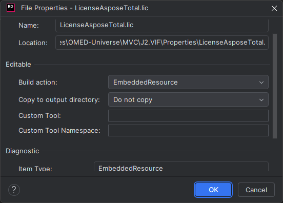

Bản quyền Aspose hiện có bản 20.11

1. Add file LicenseAsposeTotal.lic vào folder Properties của web api
2. 
3. Set License

```csharp

        private static void SetLicense() {
            //Instantiate an instance of license and set the license file through its path
            Aspose.Cells.License license = new Aspose.Cells.License();
            license.SetLicense("LicenseAsposeTotal.lic");
        }

```