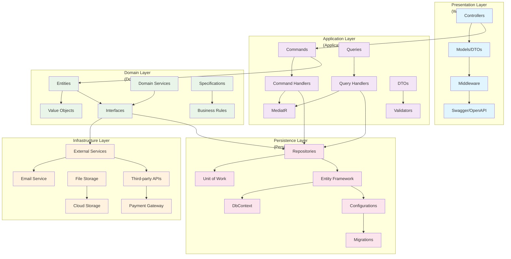
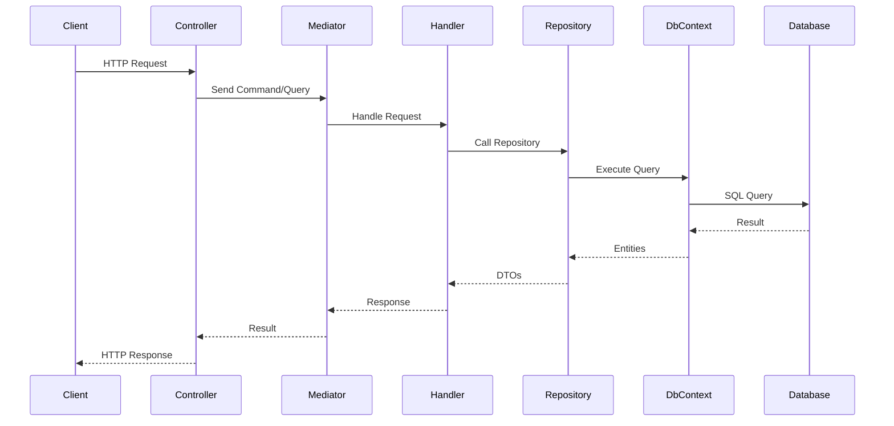
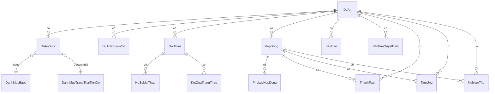
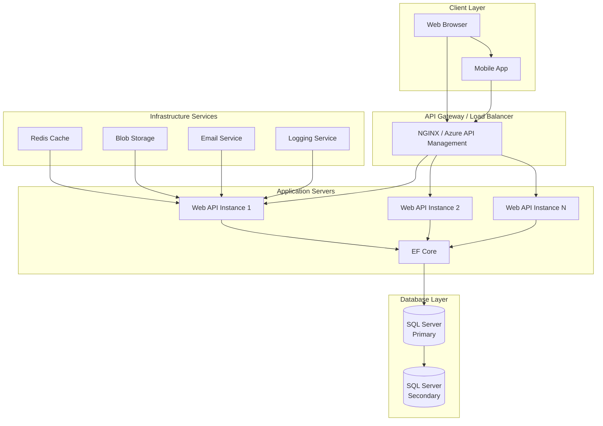

# Kiến trúc hệ thống

## Tổng quan kiến trúc

Hệ thống QLDA được xây dựng theo kiến trúc **Clean Architecture** (Kiến trúc Sạch), một approach hiện đại giúp tách biệt các concerns, dễ test, maintain và scale.

## Nguyên tắc Clean Architecture

1. **Độc lập Framework**: Business rules không phụ thuộc vào framework
2. **Testable**: Business rules có thể test mà không cần UI, Database, Web Server
3. **Độc lập UI**: UI có thể thay đổi mà không ảnh hưởng business rules
4. **Độc lập Database**: Business rules không bị ràng buộc bởi database
5. **Độc lập External Agency**: Business rules không biết gì về external concerns

## Cấu trúc Layer

## Mô tả chi tiết các Layer

### 1. Domain Layer (Lớp Miền)
**Vị trí**: `QLDA.Domain/`

**Trách nhiệm**:
- Chứa business logic cốt lõi
- Định nghĩa entities, value objects
- Repository interfaces, domain services
- Business rules và validation

**Thành phần chính**:
- **Entities**: `DuAn`, `GoiThau`, `HopDong`, etc.
- **Interfaces**: `IRepository<T>`, `IUnitOfWork`, etc.
- **Value Objects**: `Address`, `Money`, etc.
- **Domain Events**: Business events
- **Specifications**: Business rules as code

### 2. Application Layer (Lớp Ứng dụng)
**Vị trí**: `QLDA.Application/`

**Trách nhiệm**:
- Orchestrate business operations
- Use cases implementation
- Input validation
- Transaction management

**Thành phần chính**:
- **Commands**: `CreateDuAnCommand`, `UpdateGoiThauCommand`
- **Queries**: `GetDuAnListQuery`, `GetGoiThauDetailQuery`
- **Handlers**: MediatR request handlers
- **DTOs**: Data Transfer Objects
- **Validators**: FluentValidation rules

### 3. Infrastructure Layer (Lớp Hạ tầng)
**Vị trí**: `QLDA.Infrastructure/`

**Trách nhiệm**:
- External concerns implementation
- Third-party integrations
- Cross-cutting concerns

**Thành phần chính**:
- **Services**: Email, SMS, File upload
- **External APIs**: Payment gateways, SMS providers
- **Logging**: Serilog configuration
- **Caching**: Redis/Memory cache
- **Security**: Encryption, hashing

### 4. Persistence Layer (Lớp Truy cập Dữ liệu)
**Vị trí**: `QLDA.Persistence/`

**Trách nhiệm**:
- Database access implementation
- ORM configuration
- Migrations management

**Thành phần chính**:
- **DbContext**: EF Core context
- **Configurations**: Entity configurations
- **Repositories**: Generic and specific repos
- **Migrations**: Database schema changes

### 5. Presentation Layer (Lớp Trình diễn)
**Vị trí**: `QLDA.WebApi/`

**Trách nhiệm**:
- HTTP request/response handling
- API endpoints definition
- Authentication/Authorization
- Input/Output formatting

**Thành phần chính**:
- **Controllers**: API endpoints
- **Models**: Request/Response models
- **Middleware**: Custom middleware
- **Filters**: Action filters
- **Swagger**: API documentation

## Luồng xử lý Request

## Design Patterns được sử dụng

### CQRS (Command Query Responsibility Segregation)
- **Commands**: Thay đổi trạng thái (Create, Update, Delete)
- **Queries**: Đọc dữ liệu (Get, List, Search)
- **Handlers**: Xử lý commands/queries riêng biệt

### Repository Pattern
- Abstract database operations
- Unit of Work cho transaction management
- Generic repositories với specifications

### Dependency Injection
- Constructor injection
- Interface-based programming
- Lifetime management (Singleton, Scoped, Transient)

### Mediator Pattern
- MediatR cho loose coupling
- Request/Response pattern
- Pipeline behaviors cho cross-cutting concerns

## Cross-Cutting Concerns

### Logging
- Structured logging với Serilog
- Request/Response logging
- Error tracking
- Audit logging

### Validation
- **FluentValidation cho input validation**: Validators target Commands (not DTOs) to integrate with MediatR pipeline
  - Pattern: `AbstractValidator<TCommand>` with `RuleFor(x => x.Dto.Property)`
  - Validators: `DanhMucTinhTrangThucHienLcntInsertCommandValidator`, `DanhMucTinhTrangThucHienLcntUpdateCommandValidator`
- Domain validation trong entities
- Business rule validation

### Error Handling
- Global exception handling
- Custom exceptions
- Consistent error responses

### Security
- JWT authentication
- Role-based authorization
- Input sanitization
- SQL injection prevention

### Caching
- Memory cache cho data thường dùng
- Distributed cache (Redis) cho scale
- Cache invalidation strategies

## Database Design

### Entity Relationships

### Indexing Strategy
- Primary keys trên tất cả tables
- Foreign key indexes
- Composite indexes cho search queries
- Full-text search indexes nếu cần

## Deployment Architecture

## Monitoring và Observability

### Application Metrics
- Response time
- Error rate
- Throughput
- Database connection pool

### Infrastructure Metrics
- CPU/Memory usage
- Disk I/O
- Network traffic
- Database performance

### Logging
- Application logs
- Security audit logs
- Performance logs
- Error logs

### Alerting
- Error rate thresholds
- Performance degradation
- Infrastructure issues
- Security incidents

## Scalability Considerations

### Horizontal Scaling
- Stateless API instances
- Load balancer distribution
- Database read replicas
- Cache distribution

### Vertical Scaling
- Database optimization
- Query performance tuning
- Memory management
- Connection pooling

### Caching Strategy
- Application-level caching
- Database query caching
- CDN for static assets
- API response caching

## Security Architecture

### Authentication & Authorization
- JWT tokens với expiration
- Refresh token mechanism
- Role-based access control
- Claim-based permissions

### Data Protection
- Encryption at rest
- Encryption in transit (HTTPS)
- Sensitive data masking
- Backup encryption

### Network Security
- Firewall configuration
- DDoS protection
- API rate limiting
- CORS policy

## Performance Optimization

### Database Optimization
- Query optimization
- Indexing strategy
- Connection pooling
- Read/write splitting

### Application Optimization
- Async/await patterns
- Caching layers
- Response compression
- CDN integration

### Code Optimization
- Algorithm efficiency
- Memory management
- Garbage collection tuning
- Profiling and monitoring

## Testing Strategy

### Unit Tests
- Domain logic testing
- Service layer testing
- Repository testing
- Mock external dependencies

### Integration Tests
- API endpoint testing
- Database integration
- External service integration
- End-to-end workflow testing

### Performance Tests
- Load testing
- Stress testing
- Spike testing
- Endurance testing

## Future Considerations

### Microservices Migration
- Domain-driven service boundaries
- API Gateway implementation
- Service discovery
- Distributed transactions

### Cloud Migration
- Container orchestration (Kubernetes)
- Serverless functions
- Managed database services
- Cloud-native monitoring

### Advanced Features
- Real-time notifications (SignalR)
- Advanced analytics
- Machine learning integration
- Blockchain for document verification