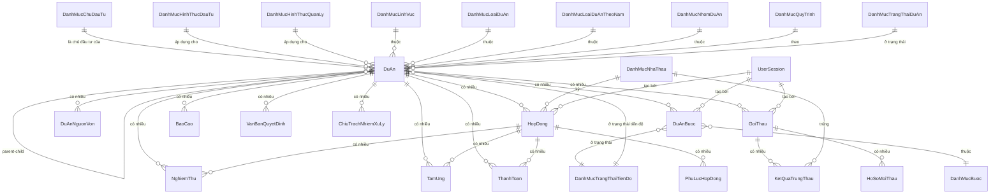

# Mô hình dữ liệu

## Tổng quan

Hệ thống QLDA sử dụng SQL Server làm cơ sở dữ liệu chính, với Entity Framework Core làm ORM. Database được thiết kế theo nguyên tắc Database Normalization, đảm bảo data integrity và performance.

## Schema chính

Database chứa các bảng chính sau:

### Bảng Dự án (DuAn)
```sql
CREATE TABLE DuAn (
    Id uniqueidentifier PRIMARY KEY,
    ParentId uniqueidentifier NULL,
    TenDuAn nvarchar(500) NULL,
    DiaDiem nvarchar(1000) NULL,
    ChuDauTuId int NULL,
    ThoiGianKhoiCong int NULL,
    ThoiGianHoanThanh int NULL,
    MaDuAn nvarchar(50) NULL,
    MaNganSach nvarchar(50) NULL,
    DuAnTrongDiem bit NOT NULL DEFAULT 0,
    LinhVucId int NULL,
    NhomDuAnId int NULL,
    NangLucThietKe nvarchar(1000) NULL,
    QuyMoDuAn nvarchar(2000) NULL,
    HinhThucQuanLyDuAnId int NULL,
    HinhThucDauTuId int NULL,
    LoaiDuAnId int NULL,
    TongMucDauTu bigint NULL,
    QuyTrinhId int NULL,
    BuocHienTaiId int NULL,
    TrangThaiHienTaiId int NULL,
    TrangThaiDuAnId int NULL,
    LoaiDuAnTheoNamId int NULL,
    GhiChu nvarchar(2000) NULL,
    NgayBatDau datetimeoffset NOT NULL,
    CreatedAt datetimeoffset NULL,
    UpdatedAt datetimeoffset NULL,
    DeletedAt datetimeoffset NULL
);
```

### Các bảng liên quan
- **DuAnBuoc**: Các bước thực hiện của dự án
- **DuAnNguonVon**: Nguồn vốn của dự án
- **GoiThau**: Gói thầu thuộc dự án
- **HopDong**: Hợp đồng thuộc dự án
- **BaoCao**: Báo cáo của dự án
- **VanBanQuyetDinh**: Văn bản quyết định
- **ThanhToan**: Thanh toán
- **TamUng**: Tạm ứng
- **NghiemThu**: Nghiệm thu

## Entity Relationship Diagram (ERD)



## Chi tiết các Entity chính

### 1. DuAn (Dự án)
**Mô tả**: Bảng chính chứa thông tin dự án

**Các trường quan trọng**:
- `Id`: Khoá chính (GUID)
- `ParentId`: Dự án cha (cho dự án con)
- `TenDuAn`: Tên dự án
- `MaDuAn`: Mã dự án
- `TongMucDauTu`: Tổng mức đầu tư
- `NgayBatDau`: Ngày bắt đầu
- `TrangThaiDuAnId`: Trạng thái dự án
- `QuyTrinhId`: Quy trình áp dụng

**Relationships**:
- 1:N với DuAnBuoc
- 1:N với DuAnNguonVon
- 1:N với GoiThau
- 1:N với HopDong
- N:1 với các bảng DanhMuc*

### 2. DuAnBuoc (Bước thực hiện dự án)
**Mô tả**: Theo dõi tiến độ từng bước của dự án theo quy trình

**Các trường quan trọng**:
- `DuAnId`: ID dự án
- `BuocId`: ID bước trong quy trình
- `TrangThaiId`: Trạng thái bước
- `NgayBatDau`: Ngày bắt đầu thực hiện
- `NgayKetThuc`: Ngày kết thúc
- `ThoiHan`: Thời hạn thực hiện (ngày)

### 3. GoiThau (Gói thầu)
**Mô tả**: Thông tin gói thầu trong dự án

**Các trường quan trọng**:
- `DuAnId`: Dự án chứa gói thầu
- `TenGoiThau`: Tên gói thầu
- `GiaGoiThau`: Giá gói thầu
- `HinhThucLuaChonNhaThauId`: Hình thức lựa chọn nhà thầu
- `TrangThaiGoiThauId`: Trạng thái gói thầu

### 4. HopDong (Hợp đồng)
**Mô tả**: Thông tin hợp đồng ký với nhà thầu

**Các trường quan trọng**:
- `DuAnId`: Dự án
- `GoiThauId`: Gói thầu
- `NhaThauId`: Nhà thầu
- `SoHopDong`: Số hợp đồng
- `GiaTriHopDong`: Giá trị hợp đồng
- `NgayKy`: Ngày ký
- `ThoiGianThucHien`: Thời gian thực hiện

### 5. ThanhToan (Thanh toán)
**Mô tả**: Thanh toán cho hợp đồng

**Các trường quan trọng**:
- `HopDongId`: Hợp đồng
- `SoTien`: Số tiền thanh toán
- `NgayThanhToan`: Ngày thanh toán
- `NoiDungThanhToan`: Nội dung thanh toán

### 6. NghiemThu (Nghiệm thu)
**Mô tả**: Nghiệm thu công việc/hợp đồng

**Các trường quan trọng**:
- `DuAnId`: Dự án
- `HopDongId`: Hợp đồng
- `LoaiNghiemThu`: Loại nghiệm thu
- `NgayNghiemThu`: Ngày nghiệm thu
- `KetQuaNghiemThu`: Kết quả

## Danh mục (DanhMuc)

Hệ thống sử dụng các bảng danh mục để chuẩn hóa dữ liệu:

### Danh mục chính:
- `DanhMucChuDauTu`: Chủ đầu tư
- `DanhMucHinhThucDauTu`: Hình thức đầu tư
- `DanhMucHinhThucQuanLy`: Hình thức quản lý
- `DanhMucLinhVuc`: Lĩnh vực
- `DanhMucLoaiDuAn`: Loại dự án
- `DanhMucNhomDuAn`: Nhóm dự án
- `DanhMucNhaThau`: Nhà thầu
- `DanhMucQuyTrinh`: Quy trình
- `DanhMucTrangThaiDuAn`: Trạng thái dự án
- `DanhMucTrangThaiTienDo`: Trạng thái tiến độ
- `DanhMucTinhTrangThucHienLcnt`: Tình trạng thực hiện LCNT (Lựa chọn nhà thầu) [UC-21]

**Cấu trúc chung**:
```sql
CREATE TABLE DanhMucChuDauTu (
    Id int PRIMARY KEY IDENTITY(1,1),
    Ten nvarchar(500) NOT NULL,
    Ma nvarchar(50) NULL,
    MoTa nvarchar(1000) NULL,
    Stt int NULL,
    Used bit NOT NULL DEFAULT 1,
    CreatedAt datetimeoffset NULL,
    UpdatedAt datetimeoffset NULL
);
```

**Bảng DmTinhTrangThucHienLcnt**:
```sql
CREATE TABLE DmTinhTrangThucHienLcnt (
    Id int PRIMARY KEY IDENTITY(1,1),
    Ma nvarchar(50) NULL,
    Ten nvarchar(255) NULL,
    MoTa nvarchar(1000) NULL,
    Stt int NULL,
    Used bit NOT NULL DEFAULT 1,
    CreatedAt datetimeoffset NULL,
    CreatedBy nvarchar(450) NULL,
    LastModifiedAt datetimeoffset NULL,
    LastModifiedBy nvarchar(450) NULL,
    DeletedAt datetimeoffset NULL,
    IsDeleted bit NOT NULL DEFAULT 0
);
```

## Indexing Strategy

### Primary Keys
- Tất cả bảng có clustered primary key
- Sử dụng IDENTITY cho bảng DanhMuc, GUID cho bảng nghiệp vụ

### Foreign Key Indexes
- Tự động tạo index cho tất cả foreign key
- Non-clustered indexes

### Performance Indexes
```sql
-- Index cho tìm kiếm dự án
CREATE INDEX IX_DuAn_TenDuAn ON DuAn(TenDuAn);
CREATE INDEX IX_DuAn_MaDuAn ON DuAn(MaDuAn);
CREATE INDEX IX_DuAn_TrangThai ON DuAn(TrangThaiDuAnId);

-- Index cho danh sách có phân trang
CREATE INDEX IX_DuAnBuoc_DuAnId_BuocId ON DuAnBuoc(DuAnId, BuocId);

-- Index cho báo cáo
CREATE INDEX IX_HopDong_DuAnId_NgayKy ON HopDong(DuAnId, NgayKy);
```

## Data Integrity

### Constraints
- NOT NULL constraints cho trường bắt buộc
- CHECK constraints cho giá trị hợp lệ
- UNIQUE constraints cho trường unique

### Foreign Key Constraints
- CASCADE DELETE cho quan hệ yếu
- RESTRICT/SET NULL cho quan hệ mạnh
- Đảm bảo referential integrity

### Business Rules
- Trigger cho business logic phức tạp
- Check constraints cho validation

## Database Design Patterns

### Materialized Path
Dự án sử dụng Materialized Path cho hierarchical structure:
- `ParentId` cho quan hệ parent-child
- Computed column cho path nếu cần

### Soft Delete
- `DeletedAt` field cho soft delete
- Global filter trong EF Core

### Audit Fields
- `CreatedAt`, `UpdatedAt` cho audit trail
- `CreatedBy`, `UpdatedBy` nếu cần

## Migration Strategy

Sử dụng EF Core Migrations:
```bash
dotnet ef migrations add InitialCreate
dotnet ef database update
```

### Migration Files
- Tự động generate từ code changes
- Manual migration cho complex changes
- Idempotent scripts

## Backup và Recovery

### Backup Strategy
- Full backup hàng tuần
- Differential backup hàng ngày
- Transaction log backup mỗi giờ

### Recovery Models
- FULL recovery model cho production
- SIMPLE cho development

## Performance Considerations

### Query Optimization
- Sử dụng indexed views cho báo cáo phức tạp
- Partitioning cho bảng lớn (nếu cần)
- Archive strategy cho dữ liệu cũ

### Connection Management
- Connection pooling
- Timeout settings
- Retry logic

### Monitoring
- Performance counters
- Query execution plans
- Blocking detection

## Future Enhancements

### Potential Improvements
- Database sharding cho scale
- Read replicas cho reporting
- Data warehouse cho analytics
- Graph database cho complex relationships

### Schema Evolution
- Backward compatibility
- Data migration scripts
- Zero-downtime deployments