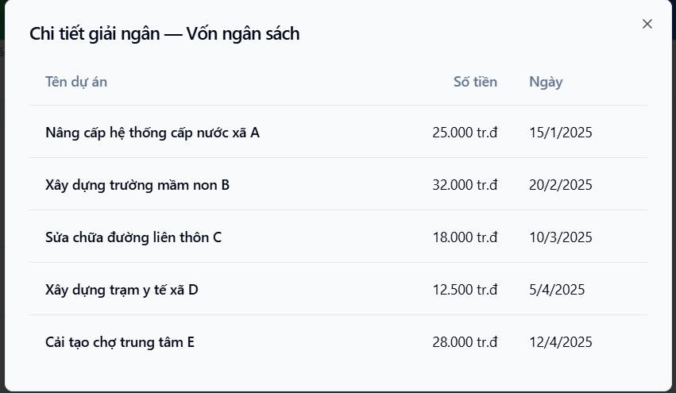

Mô tả

Em gửi thông tin UC7 còn thiếu theo hợp đồng

Tên Use case: Dashboard tình hình thực hiện giải ngân theo nguồn vốn

Tên tác nhân: CB.PCT, CB.PKH-TC, LĐ.PCT, GĐ/PGĐ, LĐ.PKH-TC

Mô tả:
1. Hiển thị tổng hợp kế hoạch vốn năm theo từng nguồn vốn
2. Xem tổng giá trị đã thực hiện (giải ngân) trong năm theo từng nguồn vốn
3. Xem tỷ lệ % so với kế hoạch theo từng nguồn vốn
4. Xem danh sách từ số tổng
5. Xem chi tiết

Giao diện tham khảo
https://dashboar-giai-ngan-theo-nguon-von.lovable.app/
