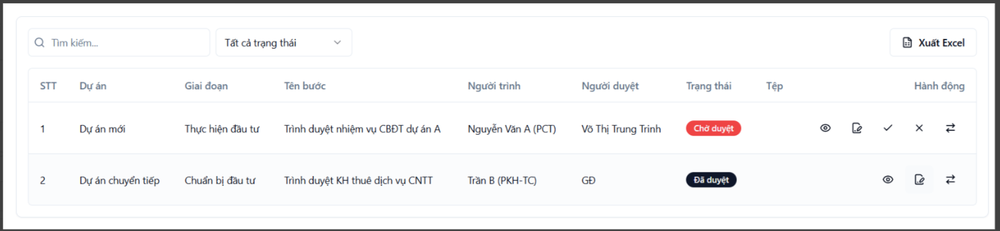
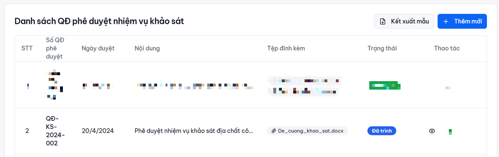

Mô tả

Em gửi thông tin UC22 còn thiếu theo hợp đồng

Tên Use case: Quản lý phê duyệt, phản hồi và ban hành nội dung trình duyệt

Tên tác nhân: CB.PCT, CB.PKH-TC, LĐ.PCT, LĐ.PKH-TC, GĐ/PGĐ, P.HC-TH

Giải thích tác nhân:
CB.PCT: cán bộ phòng chủ trì
CB.PKH-TC: cán bộ phòng kế hoạch tài chính
LĐ.PCT: lãnh đạo phòng chủ trì
LĐ.PKH-TC: lãnh đạo phòng kế hoạch tài chính
GĐ/PGĐ: giám đốc/ phó giám đốc
P.HC-TH: phòng hanh chính-tổng hợp

Mô tả:
1. GĐ/PGĐ tra cứu và xem nội dung được trình duyệt
2. GĐ/PGĐ phê duyệt/từ chối duyệt (ghi chú lý do nếu từ chối) hoặc ký số nội dung
3. CB.PCT, LĐ.PCT cập nhật lại nội dung theo yêu cầu và gửi lại
4. GĐ/PGĐ tiếp nhận lại nội dung đã cập nhật từ LĐ.PCT
5. GĐ/PGĐ có thể chuyển P.HC-TH để cho số phát hành
6. P.HC-TH có thể phát hành nội dung đã được phê duyệt lên hệ thống QLVB
7. Hệ thống gửi thông báo kết quả xử lý đến đơn vị trình duyệt
8. Ghi nhận lịch sử các lần chỉnh sửa nội dung
9. Xem lại toàn bộ luồng xử lý và người thực hiện ở từng bước

Giao diện tham khảo
Bổ sung left menu "Quản lý phê duyệt, phản hồi"
Thao tác:
Chọn left menu => hiển thị danh sách

Dữ liệu lấy ở bước tiến độ có tờ trình hay QĐ của phòng ban bấm chuyển/ trình thì bên MH này mới hiển thị 1 dòng và BGĐ vô duyệt/ từ chối / ký số / chuyển qlvb
!!Lưu ý: Khi chọn nút ký số thì hiển thị danh sách file để chọn file cần ký
Ví dụ: Tiến độ có bước trình BGĐ duyệt/ký số => Bên "Quản lý phê duyệt, phản hồi" hiển thị 1 dòng dữ liệu để BGĐ có thể ký số/ Duyệt/ Từ chối / Chuyển qua pm QLVB . Và khi đã ký số/ Duyệt/ Từ chối thì cũng cập nhật ngược lại trong tiến độ đối với bước tương ứng

