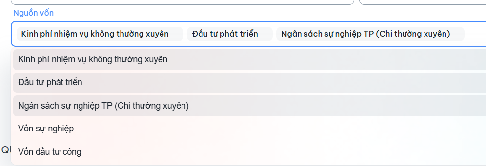
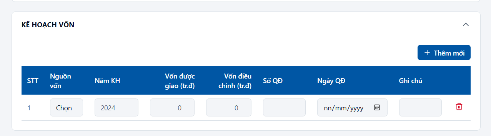
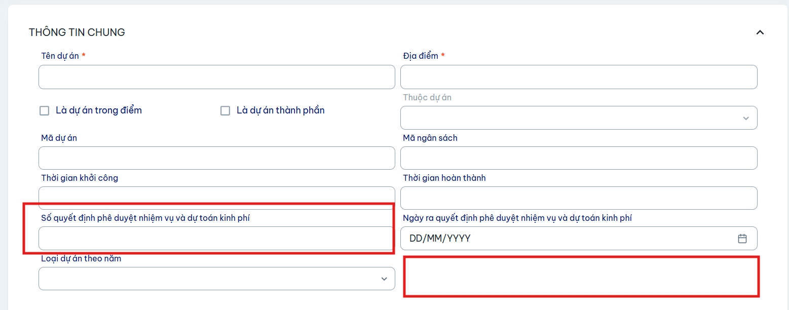
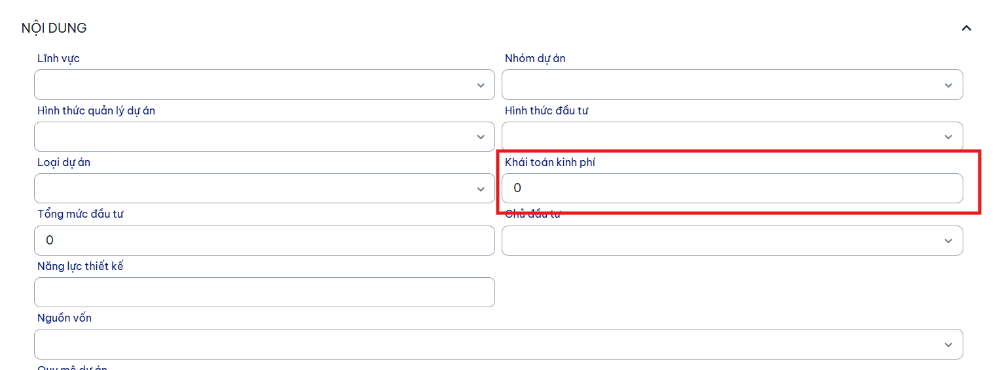

Mô tả:
1. bổ sung phần Kế hoạch vốn
Các thông tin của Kế hoạch vốn
- Nguồn vốn: load theo ccb Nguồn đã chọn (bắt buộc)
- 
- Năm KH (bắt buộc)
- Vốn được giao (bắt buộc)
- Vốn điều chỉnh
- Số QĐ
- Ngày QĐ
- Ghi chú
- File đính kèm

Giao diện tham khảo

https://baocao-tongquan.lovable.app/them-du-an

2. Bổ sung trường thông tin Số quyết định phê duyệt nhiệm vụ và dự toán kinh phí và cho đính kèm file quyết định

3. Bổ sung trường thông tin Khái toán kinh phí nhập giống Tổng mức đầu tư

