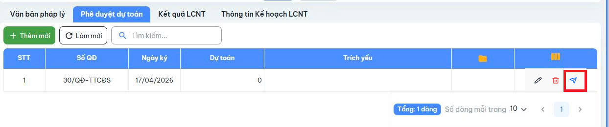

45/ Phê duyệt dự toán giai đoạn chuẩn bị đầu tư
CB.PKH-TC, LD.PKH-TC có thể ký số phiếu trình kết kết quả rà soát nội dung Tờ trình và kiến nghị GĐ/PGĐ phụ trách phê duyệt dự toán nhiệm vụ chuẩn bị đầu tư
GĐ/PGĐ có thể ký số/phê duyệt QĐ dự toán nhiệm vụ chuẩn bị đầu tư

Mô tả:
Bổ sung cột trạng thái ( Dự thảo, Đã trình, Đã duyệt, Trả lại )
Với phòng KH-TC sau khi thêm mới hiển thị ở danh sách Phê duyệt dự toán
=>Bổ sung chức năng Trình
Với phòng BGĐ vô màn hình Phê duyệt dự toán
=>Bổ sung chức năng Duyệt / Trả lại (Chỉ hiển thị khi QĐ có tình trạng Đã trình)

Giao diện tham khảo

Phê duyệt dự toán là màn hình riêng hay là 1 tab trong các bước của tiến độ?
Ban Giám đốc phải đi từng dự án, kiểm tra từng bước để kiểm tra xem có dự toán nào cần phê duyệt hay thế nào ?

Trích dẫn #5
 bs cột trangThaiId cho Phe duyệt dự toán
Người duyệt : là người phụ trách dự án
Người trình : user thuộc phòng KH_TC (phongbanid= 219)

2 api : duyệt/Trình/Trả lại

Có thể dùng chung api
PheDuyetDuToan_history :
1. NguoiTrinh/duyet
2. trangthai( trinh/duyet/tra lai),
3. nội dung(lý do)
4. NgayXuLy
4. PheDuyetDuToanId
5. DuAnId

UI. lưu ý có confirm popup trước khi trình/gửi