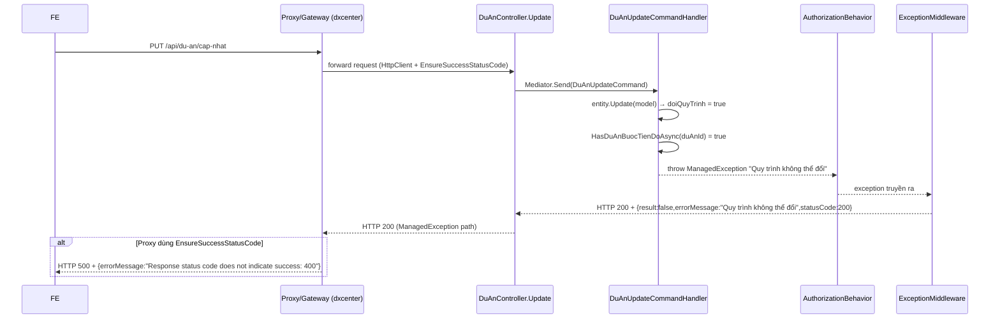

# Báo cáo triển khai — Fix `du-an/cap-nhat` "Quy trình không thể đổi"

**Module:** QLDA
**Ngày:** 2026-08-18
**Trạng thái:** Phân tích xong root cause — chưa implement
**Pattern tham chiếu:** `DuAnUpdateCommand`, `DuAnBuocCloneCommand`, `ExceptionMiddleware`

---

## Mục lục

1. [Tóm tắt vấn đề](#1-tóm-tắt-vấn-đề)
2. [Chỗ lỗi (root cause)](#2-chỗ-lỗi-root-cause)
3. [Luồng request](#3-luồng-request)
4. [Vì sao 400 bị biến thành 500](#4-vì-sao-400-bị-biến-thành-500)
5. [Field/value gây lỗi](#5-fieldvalue-gây-lỗi)
6. [Cách sửa](#6-cách-sửa)
7. [Files liên quan](#7-files-liên-quan)
8. [Test plan](#8-test-plan)

---

## 1. Tóm tắt vấn đề

### 1.1. Case test

| Thuộc tính | Giá trị |
|------------|---------|
| Endpoint | `PUT /api/du-an/cap-nhat` |
| `id` | `08defc3c-2db8-a6d1-687a-7b252c02763d` (payload user) / `08de9abc-c7ea-4b75-687a-7b210c03e6c1` (log thật) |
| `quyTrinhId` | 48 (payload user) / 46 (log thật) — khác quy trình hiện tại |

### 1.2. Triệu chứng

| # | Triệu chứng | Mức độ |
|---|-------------|--------|
| 1 | FE báo `Request failed with status code 500` | Blocker |
| 2 | Body trả về `errorMessage: "Response status code does not indicate success: 400 (Bad Request)."` | — |
| 3 | Backend log ghi `"Quy trình không thể đổi"` | — |

---

## 2. Chỗ lỗi (root cause)

### 2.1. Nơi ném lỗi

```
File:   QLDA.Application/DuAns/Commands/DuAnUpdateCommand.cs
Method: DuAnUpdateCommandHandler.Handle — dòng 51–54
```

```csharp
// dòng 51
var doiQuyTrinh = entity.QuyTrinhId != request.Model.QuyTrinhId;
ManagedException.ThrowIf(
    doiQuyTrinh && await HasDuAnBuocTienDoAsync(entity.Id, cancellationToken),  // dòng 52-53
    "Quy trình không thể đổi");                                                 // dòng 54
```

### 2.2. Helper kiểm tra tiến độ

```
File:   QLDA.Application/DuAns/Commands/DuAnUpdateCommand.cs
Method: HasDuAnBuocTienDoAsync — dòng 114–127
```

```csharp
private async Task<bool> HasDuAnBuocTienDoAsync(Guid duAnId, CancellationToken cancellationToken) {
    return await DuAnBuoc.GetQueryableSet(OnlyUsed: false)
        .AnyAsync(e =>
            e.DuAnId == duAnId && (
                e.NgayDuKienBatDau != null
                || e.NgayDuKienKetThuc != null
                || e.NgayThucTeBatDau != null
                || e.NgayThucTeKetThuc != null
                || e.TrangThaiId != null
                || e.IsKetThuc
                || (e.GhiChu != null && e.GhiChu != "")
                || (e.TrachNhiemThucHien != null && e.TrachNhiemThucHien != "")
            ), cancellationToken);
}
```

### 2.3. Cơ chế kích hoạt

Guard ném lỗi khi **đồng thời** thoả 2 điều kiện:

1. **`doiQuyTrinh = true`** — `quyTrinhId` gửi lên khác `DuAn.QuyTrinhId` hiện tại.
2. **`HasDuAnBuocTienDoAsync = true`** — dự án đã có ít nhất một `DuAnBuoc` mang dấu hiệu tiến độ:
   - `NgayDuKienBatDau` / `NgayDuKienKetThuc` (ngày dự kiến)
   - `NgayThucTeBatDau` / `NgayThucTeKetThuc` (ngày thực tế)
   - `TrangThaiId`
   - `IsKetThuc`
   - `GhiChu` khác rỗng
   - `TrachNhiemThucHien` khác rỗng

> Ý nghĩa nghiệp vụ: không cho phép đổi quy trình khi dự án đã triển khai/ghi tiến độ, tránh dữ liệu `DuAnBuoc` (clone theo quy trình cũ) bị lệch so với quy trình mới.

### 2.4. Bằng chứng log thật

`QLDA.WebApi/logs/service-20260817.log`:

```
[2026-08-17 11:00:43  INF]  Request starting HTTP/1.1 PUT /api/du-an/cap-nhat
[2026-08-17 11:00:43  INF]  Messenger Request: DuAnUpdateCommand {"Model":{...,"QuyTrinhId":46,...}}
[2026-08-17 11:00:44  ERR]  Messenger Request: Unhandled Exception for Request DuAnUpdateCommand
[2026-08-17 11:00:44  ERR]  HTTP PUT /api/du-an/cap-nhat responded 500
[2026-08-17 11:00:44  ERR]  An error occurred with custom message: Quy trình không thể đổi. Full details: Quy trình không thể đổi
[2026-08-17 11:00:44  INF]  Request finished HTTP/1.1 PUT /api/du-an/cap-nhat - 200
```

---

## 3. Luồng request



---

## 4. Vì sao 400 bị biến thành 500

- **Backend QLDA** không hề có `HttpClient` / `EnsureSuccessStatusCode`; chuỗi `"Response status code does not indicate success: 400"` **không tồn tại trong code QLDA** (`git grep` ra 0 kết quả ở source, chỉ có trong `QLDA.Tests`).
- `ManagedException` được `ExceptionMiddleware` (`BuildingBlocks.Application/Middlewares/ExceptionMiddleware.cs:20-21`) bắt và trả **HTTP 200**, body `{result:false, errorMessage:"Quy trình không thể đổi", statusCode:200}`.
- Chuỗi `"Response status code does not indicate success: 400 (Bad Request)."` + mã **500** là do **proxy/gateway trước QLDA** (dxcenter) gọi QLDA bằng `HttpClient.EnsureSuccessStatusCode()`. Khi QLDA trả status không phải 2xx, proxy ném exception này và trả **500** cho FE, đồng thời đè body bằng message của `HttpRequestException`.

> Kết luận: lỗi thật là **"Quy trình không thể đổi"**; phần `400 → 500` là do proxy che đi message thật.

---

## 5. Field/value gây lỗi

| Field | Giá trị FE gửi | Backend yêu cầu |
|-------|----------------|-----------------|
| `quyTrinhId` | 48 (ví dụ) / 46 (log thật) — khác quy trình hiện tại | Không cho đổi vì dự án đã có tiến độ ở `DuAnBuoc` |

Các field khác (`id`, `tenDuAn`, `diaDiem`) đều hợp lệ; model binding và validation pass.

---

## 6. Cách sửa

> Chọn phương án theo nghiệp vụ. Không thay đổi những phần không liên quan.

### Phương án A (khuyến nghị — đúng nghiệp vụ): FE không đổi quy trình khi đã có tiến độ

- Khi dự án đã nhập tiến độ, FE **không gửi** `quyTrinhId` (hoặc gửi đúng giá trị hiện tại) trong lúc sửa.
- Không cần đổi backend; guard vẫn bảo vệ dữ liệu.

### Phương án B: Cho phép đổi nhưng xử lý dữ liệu DuAnBuoc

- Trước khi đổi quy trình, **xoá tiến độ / reset** các `DuAnBuoc` cũ, rồi gọi `DuAnBuocCloneCommand` để clone lại theo quy trình mới.
- Vị trí sửa: `DuAnUpdateCommand.cs` (bỏ/siết guard) + `DuAnController.Update` (đã gọi `DuAnBuocCloneCommand` khi quy trình đổi, dòng 322–325).

### Phương án C: Sửa tầng proxy (giải quyết triệu chứng 400→500)

- Proxy không dùng `EnsureSuccessStatusCode()` mù; **forward đúng HTTP status + body** thật của QLDA xuống FE để FE hiển thị message rõ ràng thay vì `500`.

---

## 7. Files liên quan

| File | Vai trò |
|------|---------|
| `QLDA.Application/DuAns/Commands/DuAnUpdateCommand.cs` | Nơi ném `"Quy trình không thể đổi"` (dòng 51–54, 114–127) |
| `QLDA.WebApi/Controllers/DuAnController.cs` | Endpoint `Update` (dòng 302–368); gọi clone khi đổi quy trình |
| `QLDA.Application/DuAnBuocs/Commands/DuAnBuocCloneCommand.cs` | Clone bước theo quy trình |
| `BuildingBlocks.Application/Middlewares/ExceptionMiddleware.cs` | Bắt exception, quyết định HTTP status |
| `QLDA.WebApi/logs/service-20260817.log` | Log chứng cứ lỗi |

---

## 8. Test plan

Xem chi tiết tại [test-workflow.md](test-workflow.md).
