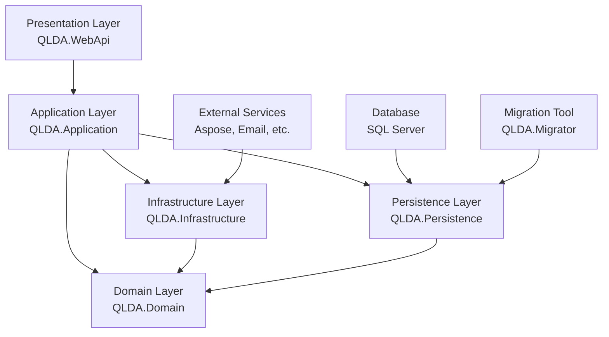
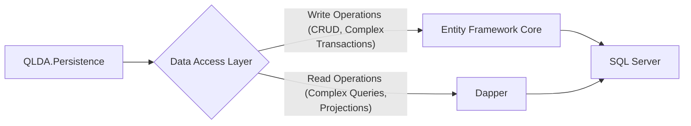
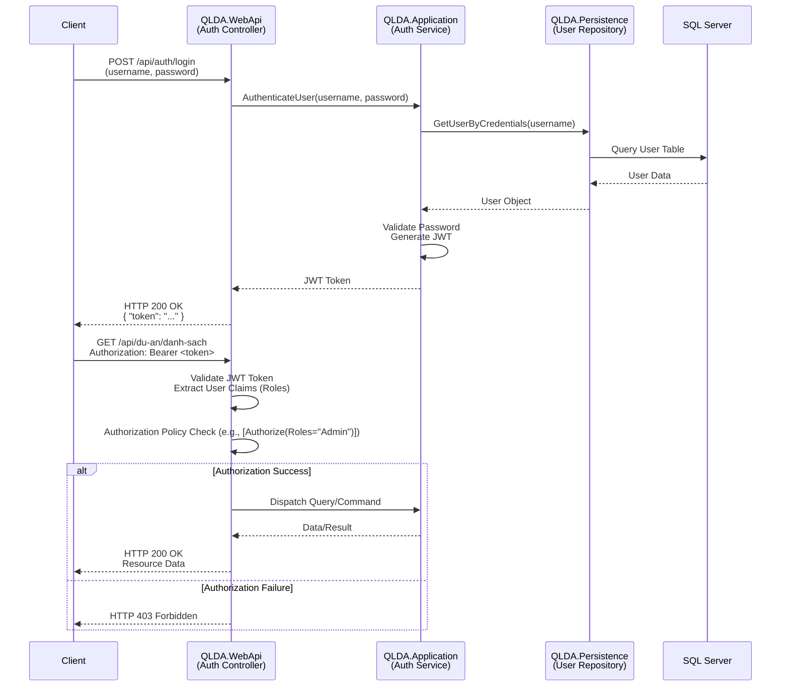

# System Architecture - QLDA

This document details the system architecture of the QLDA (Quản Lý Dự Án - Project Management System) application, focusing on its layered structure, request/response flow, data access patterns, authentication/authorization, cross-cutting concerns, and deployment considerations.

## 1. Layered Architecture (Clean Architecture)

The QLDA system is built upon a Clean Architecture approach, emphasizing separation of concerns and dependency inversion. This creates a highly maintainable, testable, and flexible codebase.



-   **Domain Layer (`QLDA.Domain`):** Contains enterprise-wide business rules. It is the core of the application and holds entities, value objects, domain services, and interfaces. It has no dependencies on other layers.
-   **Application Layer (`QLDA.Application`):** Contains application-specific business rules and orchestrates the domain layer to fulfill use cases. It implements the CQRS pattern with MediatR, DTOs, and validators. It depends only on the Domain layer.
-   **Infrastructure Layer (`QLDA.Infrastructure`):** Houses implementations for external concerns like file systems, email services, date/time services, and other third-party integrations (e.g., Aspose). It depends on the Application and Domain layers.
-   **Persistence Layer (`QLDA.Persistence`):** Responsible for data access, including EF Core DbContext, migrations, and repository implementations (both EF Core and Dapper). It depends on the Application and Domain layers.
-   **Presentation Layer (`QLDA.WebApi`):** The outermost layer, exposing the Web API endpoints. It handles HTTP requests, authentication, and serialization. It depends on the Application, Infrastructure, and Persistence layers.
-   **Migration Tool (`QLDA.Migrator`):** A dedicated project to manage and apply database schema changes using EF Core migrations, depending on the Persistence layer.

## 2. Request/Response Flow (CQRS with MediatR)

The system leverages the CQRS (Command Query Responsibility Segregation) pattern, facilitated by MediatR, to clearly separate operations that change state (Commands) from operations that retrieve data (Queries).

```mermaid
graph TD
    A[Client Request] --> B[QLDA.WebApi Controller]
    B -- Command (Write) --> C[MediatR Dispatcher]
    C -- Pipeline Behaviors --> D[Validation Behavior]
    D --> E[Logging Behavior]
    E --> F[Transaction Behavior]
    F --> G[Command Handler<br>(QLDA.Application)]
    G --> H[Domain Entities<br>(QLDA.Domain)]
    H --> I[Repository<br>(QLDA.Persistence)]
    I -- EF Core/Dapper --> J[SQL Server]
    G -- Updates State --> J
    C -- Query (Read) --> K[Query Handler<br>(QLDA.Application)]
    K --> I
    I -- EF Core/Dapper --> J
    K --> L[DTO Mapping]
    L --> M[Client Response]
    J -- Data --> I
    I -- Data --> K
    K -- DTO --> L
    L -- DTO --> B
    B -- Response --> A
```

1.  **Client Request:** A client sends an HTTP request to the QLDA.WebApi.
2.  **Controller:** The `QLDA.WebApi` controller receives the request.
3.  **MediatR Dispatcher:** The controller dispatches either a `Command` (for state changes) or a `Query` (for data retrieval) to MediatR.
4.  **Pipeline Behaviors:** The command/query passes through a series of pipeline behaviors (e.g., Logging, Validation, Transaction Management) implemented in `QLDA.Application/Common/Behaviours`.
5.  **Command Handler:** For Commands, the dedicated `CommandHandler` (in `QLDA.Application`) executes the business logic, interacts with `Domain Entities`, and uses `Repositories` (from `QLDA.Persistence`) to persist changes to the `SQL Server` database.
6.  **Query Handler:** For Queries, the `QueryHandler` (in `QLDA.Application`) retrieves data using `Repositories` (from `QLDA.Persistence`), which in turn query the `SQL Server` database.
7.  **DTO Mapping:** Retrieved domain entities are mapped to appropriate DTOs by the `QueryHandler`.
8.  **Client Response:** The `QLDA.WebApi` controller returns the DTO as an HTTP response to the client.

## 3. Data Access Patterns (EF Core + Dapper)

The system employs a hybrid data access strategy, combining the benefits of Entity Framework Core (ORM) and Dapper (micro-ORM).



-   **Entity Framework Core:** Used for most CRUD operations and complex transactions where object-relational mapping capabilities are beneficial. It handles tracking changes, concurrency, and relationship management.
-   **Dapper:** Employed for highly optimized read operations, especially for complex queries, reporting, or scenarios where direct SQL query execution provides significant performance advantages. This bypasses EF Core's change tracking overhead for reads.
-   **Repository Pattern:** A generic repository pattern is implemented, exposing common data access methods. Specific repositories might extend this for entity-specific operations.
-   **Unit of Work:** The `ApplicationDbContext` acts as the Unit of Work, coordinating changes across multiple repositories and ensuring atomicity.

## 4. Authentication and Authorization Flow

The API secures its resources using JWT Bearer authentication and implements role-based authorization, specifically Role-Based Access Control (RBAC).



-   **Authentication:** Users send credentials (username/password) to the `/api/auth/login` endpoint. The `AuthService` in the `Application` layer validates these against the `UserRepository` in `Persistence` (which queries the database). Upon successful validation, a JWT token is generated and returned to the client.
-   **Authorization:** For subsequent requests, the client includes the JWT token in the `Authorization: Bearer` header. The `QLDA.WebApi` validates the token, extracts user claims (including roles), and applies ASP.NET Core Authorization Policies (`[Authorize]` attributes on controllers/actions) to enforce access control.
    -   **RBAC Implementation Phases:**
        -   **Phase 01 (Base Controllers):** Implemented `[Authorize(Roles = "Administrator")]` on the base controller (`AggregateRootController.cs`) for broad administrative access.
        -   **Phase 02 (DanhMuc* Controllers):** Applied `[Authorize(Roles = "AdminOrManager")]` to 26 `DanhMuc*` controllers, allowing both administrators and managers access. This involved updating `QLDA.Domain/Constants/RoleConstants.cs` for role definitions.
        -   **Phase 03 (Business Controllers):** Approximately 30 business controllers inherit the admin-only authorization from the base controller.
    -   **Authorization Matrix Example:**

        | Controller Type | QLDA_TatCa | QLDA_QuanTri |
        |-----------------|------------|--------------|
        | DanhMuc* (26) | ✅ Access | ✅ Access |
        | Business (~30) | ✅ Access | ❌ 403 |

## 5. Cross-Cutting Concerns

Cross-cutting concerns are managed through various mechanisms to keep the core business logic clean.

-   **Logging:** Integrated using Serilog (or similar) across all layers, configured in `QLDA.WebApi`. MediatR pipeline behaviors provide centralized logging for command/query execution.
-   **Validation:** Handled by FluentValidation, integrated into the MediatR pipeline as a behavior in the Application layer, ensuring all incoming commands and DTOs are validated before execution.
-   **Error Handling:** A global exception handling middleware in `QLDA.WebApi` catches unhandled exceptions and returns standardized Problem Details (RFC 7807) to the client, preventing sensitive information leakage.
-   **Auditing:** `BaseEntity` includes `CreatedBy`, `CreatedAt`, `LastModifiedBy`, `LastModifiedAt` fields, automatically populated by EF Core interceptors or application-level services to track data changes.
-   **Transaction Management:** Handled by a MediatR pipeline behavior in `QLDA.Application`, ensuring that multiple data operations within a command are committed or rolled back atomically.

## 6. Deployment Considerations

-   **Containerization:** The `QLDA.WebApi` application can be containerized using Docker for consistent environments and easier deployment to platforms like Kubernetes or Azure App Services.
-   **CI/CD Pipeline:** Automated Continuous Integration/Continuous Deployment pipelines (e.g., Azure DevOps, GitHub Actions) for building, testing, and deploying the application and its migrations.
-   **Configuration Management:** Use environment variables and `appsettings.json` for application configuration, separating environment-specific settings.
-   **Monitoring:** Integrate with application performance monitoring (APM) tools (e.g., Application Insights, Prometheus/Grafana) to monitor health, performance, and errors in production.
-   **Database Migrations:** The `QLDA.Migrator` project should be run as part of the deployment process to apply pending database migrations. This can be integrated into the CI/CD pipeline or executed manually.

---
*This document will be updated as the system evolves.*
