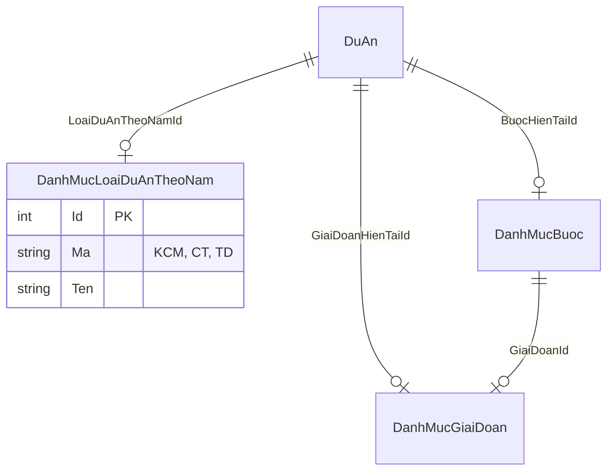

# Dashboard API Implementation Plan

## Overview

Tạo DashboardController với các endpoint thống kê dự án (DuAn) theo năm, loại dự án theo năm, bước và giai đoạn.

## Requirements Summary

| Endpoint | Description | Filter |
|----------|-------------|--------|
| `GET /api/thong-ke/tong-theo-nam` | Tổng số dự án trong năm | `nam` (required) |
| `GET /api/thong-ke/khoi-cong-moi` | Dự án khởi công mới (KCM) | `nam` (required) |
| `GET /api/thong-ke/chuyen-tiep` | Dự án chuyển tiếp (CT) | `nam` (required) |
| `GET /api/thong-ke/ton-dong` | Dự án tồn đọng (TD) | `nam` (required) |
| `GET /api/thong-ke/theo-buoc` | Dự án theo bước (BuocHienTai) | `nam` (required) |
| `GET /api/thong-ke/theo-giai-doan` | Dự án theo giai đoạn | `nam` (required) |

**Note:** Loại dự án theo năm được xác định bằng `DuAn.LoaiDuAnTheoNamId` -> `DanhMucLoaiDuAnTheoNam.Ma`

## Architecture Design

### CQRS Layers

```
QLDA.Domain          -> Enum, Entities
QLDA.Application     -> DTOs, Queries, Handlers
QLDA.WebApi          -> Controllers
```

### Data Flow

```
Controller -> Mediator.Send(Query) -> QueryHandler -> Repository -> DB
                    ↓
              Response DTO
```

### Key Relationships



## Files to Create

### Domain Layer

| File | Purpose |
|------|---------|
| `QLDA.Domain/Enums/EnumLoaiDuAnTheoNam.cs` | Enum for KCM, CT, TD values |

### Application Layer

| File | Purpose |
|------|---------|
| `QLDA.Application/Dashboard/DTOs/DashboardDto.cs` | Response DTOs |
| `QLDA.Application/Dashboard/Queries/DashboardGetTongTheoNamQuery.cs` | Total projects by year |
| `QLDA.Application/Dashboard/Queries/DashboardGetLoaiDuAnQuery.cs` | By project type (KCM/CT/TD) |
| `QLDA.Application/Dashboard/Queries/DashboardGetTheoBuocQuery.cs` | By step (Buoc) |
| `QLDA.Application/Dashboard/Queries/DashboardGetTheoGiaiDoanQuery.cs` | By stage (GiaiDoan) |

### WebApi Layer

| File | Purpose |
|------|---------|
| `QLDA.WebApi/Controllers/DashboardController.cs` | API endpoints |

## Implementation Steps

### Phase 1: Domain - Create Enum (15 min)

**File:** `QLDA.Domain/Enums/EnumLoaiDuAnTheoNam.cs`

```csharp
using System.ComponentModel;

namespace QLDA.Domain.Enums;

/// <summary>
/// Loại dự án theo năm tài chính
/// </summary>
public enum EnumLoaiDuAnTheoNam {
    [Description("Khởi công mới")] KCM,
    [Description("Chuyển tiếp")] CT,
    [Description("Tồn đọng")] TD
}
```

**Note:** Enum dùng cho code logic, actual data vẫn từ `DanhMucLoaiDuAnTheoNam` table với `Ma` field.

### Phase 2: Application - Create DTOs (20 min)

**File:** `QLDA.Application/Dashboard/DTOs/DashboardDto.cs`

```csharp
namespace QLDA.Application.Dashboard.DTOs;

/// <summary>
/// DTO tổng số dự án theo năm
/// </summary>
public class DashboardTongDto {
    public int Nam { get; set; }
    public int TongSoDuAn { get; set; }
}

/// <summary>
/// DTO thống kê theo loại dự án (KCM/CT/TD)
/// </summary>
public class DashboardLoaiDuAnDto {
    public int Nam { get; set; }
    public int LoaiDuAnTheoNamId { get; set; }
    public string? Ma { get; set; }
    public string? Ten { get; set; }
    public int SoLuong { get; set; }
}

/// <summary>
/// DTO thống kê theo bước
/// </summary>
public class DashboardTheoBuocDto {
    public int BuocId { get; set; }
    public string? TenBuoc { get; set; }
    public int SoLuong { get; set; }
}

/// <summary>
/// DTO thống kê theo giai đoạn
/// </summary>
public class DashboardTheoGiaiDoanDto {
    public int GiaiDoanId { get; set; }
    public string? TenGiaiDoan { get; set; }
    public int SoLuong { get; set; }
}
```

### Phase 3: Application - Create Queries (1.5h)

#### Query 1: Tổng dự án theo năm

**File:** `QLDA.Application/Dashboard/Queries/DashboardGetTongTheoNamQuery.cs`

```csharp
using MediatR;
using Microsoft.EntityFrameworkCore;
using Microsoft.Extensions.DependencyInjection;
using QLDA.Application.Dashboard.DTOs;
using QLDA.Domain.Entities;
using QLDA.Domain.Interfaces;

namespace QLDA.Application.Dashboard.Queries;

public record DashboardGetTongTheoNamQuery(int Nam) : IRequest<DashboardTongDto>;

internal class DashboardGetTongTheoNamQueryHandler
    : IRequestHandler<DashboardGetTongTheoNamQuery, DashboardTongDto> {

    private readonly IRepository<DuAn, Guid> _duAn;

    public DashboardGetTongTheoNamQueryHandler(IServiceProvider serviceProvider) {
        _duAn = serviceProvider.GetRequiredService<IRepository<DuAn, Guid>>();
    }

    public async Task<DashboardTongDto> Handle(
        DashboardGetTongTheoNamQuery request,
        CancellationToken cancellationToken) {

        var count = await _duAn.GetQueryableSet()
            .AsNoTracking()
            .Where(e => !e.IsDeleted)
            .Where(e => e.ThoiGianKhoiCong <= request.Nam &&
                        e.ThoiGianHoanThanh >= request.Nam)
            .CountAsync(cancellationToken);

        return new DashboardTongDto {
            Nam = request.Nam,
            TongSoDuAn = count
        };
    }
}
```

#### Query 2: Thống kê theo loại dự án (KCM/CT/TD)

**File:** `QLDA.Application/Dashboard/Queries/DashboardGetLoaiDuAnQuery.cs`

```csharp
using MediatR;
using Microsoft.EntityFrameworkCore;
using Microsoft.Extensions.DependencyInjection;
using QLDA.Application.Dashboard.DTOs;
using QLDA.Domain.Entities;
using QLDA.Domain.Entities.DanhMuc;
using QLDA.Domain.Interfaces;

namespace QLDA.Application.Dashboard.Queries;

/// <summary>
/// Query lấy thống kê theo loại dự án theo năm (KCM/CT/TD)
/// </summary>
public record DashboardGetLoaiDuAnQuery(int Nam, string? Ma = null)
    : IRequest<List<DashboardLoaiDuAnDto>>;

internal class DashboardGetLoaiDuAnQueryHandler
    : IRequestHandler<DashboardGetLoaiDuAnQuery, List<DashboardLoaiDuAnDto>> {

    private readonly IRepository<DuAn, Guid> _duAn;

    public DashboardGetLoaiDuAnQueryHandler(IServiceProvider serviceProvider) {
        _duAn = serviceProvider.GetRequiredService<IRepository<DuAn, Guid>>();
    }

    public async Task<List<DashboardLoaiDuAnDto>> Handle(
        DashboardGetLoaiDuAnQuery request,
        CancellationToken cancellationToken) {

        var query = _duAn.GetQueryableSet()
            .AsNoTracking()
            .Include(e => e.LoaiDuAnTheoNam)
            .Where(e => !e.IsDeleted)
            .Where(e => e.ThoiGianKhoiCong <= request.Nam &&
                        e.ThoiGianHoanThanh >= request.Nam);

        if (!string.IsNullOrEmpty(request.Ma)) {
            query = query.Where(e => e.LoaiDuAnTheoNam != null &&
                                     e.LoaiDuAnTheoNam.Ma == request.Ma);
        }

        var result = await query
            .GroupBy(e => new {
                e.LoaiDuAnTheoNamId,
                e.LoaiDuAnTheoNam!.Ma,
                e.LoaiDuAnTheoNam.Ten
            })
            .Select(g => new DashboardLoaiDuAnDto {
                Nam = request.Nam,
                LoaiDuAnTheoNamId = g.Key.LoaiDuAnTheoNamId ?? 0,
                Ma = g.Key.Ma,
                Ten = g.Key.Ten,
                SoLuong = g.Count()
            })
            .ToListAsync(cancellationToken);

        return result;
    }
}
```

#### Query 3: Thống kê theo bước

**File:** `QLDA.Application/Dashboard/Queries/DashboardGetTheoBuocQuery.cs`

```csharp
using MediatR;
using Microsoft.EntityFrameworkCore;
using Microsoft.Extensions.DependencyInjection;
using QLDA.Application.Dashboard.DTOs;
using QLDA.Domain.Entities;
using QLDA.Domain.Interfaces;

namespace QLDA.Application.Dashboard.Queries;

/// <summary>
/// Query lấy thống kê dự án theo bước hiện tại
/// </summary>
public record DashboardGetTheoBuocQuery(int Nam) : IRequest<List<DashboardTheoBuocDto>>;

internal class DashboardGetTheoBuocQueryHandler
    : IRequestHandler<DashboardGetTheoBuocQuery, List<DashboardTheoBuocDto>> {

    private readonly IRepository<DuAn, Guid> _duAn;

    public DashboardGetTheoBuocQueryHandler(IServiceProvider serviceProvider) {
        _duAn = serviceProvider.GetRequiredService<IRepository<DuAn, Guid>>();
    }

    public async Task<List<DashboardTheoBuocDto>> Handle(
        DashboardGetTheoBuocQuery request,
        CancellationToken cancellationToken) {

        var result = await _duAn.GetQueryableSet()
            .AsNoTracking()
            .Include(e => e.BuocHienTai)
            .Where(e => !e.IsDeleted)
            .Where(e => e.BuocHienTaiId.HasValue)
            .Where(e => e.ThoiGianKhoiCong <= request.Nam &&
                        e.ThoiGianHoanThanh >= request.Nam)
            .GroupBy(e => new {
                BuocId = e.BuocHienTaiId!.Value,
                TenBuoc = e.BuocHienTai!.TenBuoc
            })
            .Select(g => new DashboardTheoBuocDto {
                BuocId = g.Key.BuocId,
                TenBuoc = g.Key.TenBuoc,
                SoLuong = g.Count()
            })
            .OrderBy(e => e.BuocId)
            .ToListAsync(cancellationToken);

        return result;
    }
}
```

#### Query 4: Thống kê theo giai đoạn

**File:** `QLDA.Application/Dashboard/Queries/DashboardGetTheoGiaiDoanQuery.cs`

```csharp
using MediatR;
using Microsoft.EntityFrameworkCore;
using Microsoft.Extensions.DependencyInjection;
using QLDA.Application.Dashboard.DTOs;
using QLDA.Domain.Entities;
using QLDA.Domain.Interfaces;

namespace QLDA.Application.Dashboard.Queries;

/// <summary>
/// Query lấy thống kê dự án theo giai đoạn hiện tại
/// </summary>
public record DashboardGetTheoGiaiDoanQuery(int Nam) : IRequest<List<DashboardTheoGiaiDoanDto>>;

internal class DashboardGetTheoGiaiDoanQueryHandler
    : IRequestHandler<DashboardGetTheoGiaiDoanQuery, List<DashboardTheoGiaiDoanDto>> {

    private readonly IRepository<DuAn, Guid> _duAn;

    public DashboardGetTheoGiaiDoanQueryHandler(IServiceProvider serviceProvider) {
        _duAn = serviceProvider.GetRequiredService<IRepository<DuAn, Guid>>();
    }

    public async Task<List<DashboardTheoGiaiDoanDto>> Handle(
        DashboardGetTheoGiaiDoanQuery request,
        CancellationToken cancellationToken) {

        var result = await _duAn.GetQueryableSet()
            .AsNoTracking()
            .Include(e => e.GiaiDoanHienTai)
            .Where(e => !e.IsDeleted)
            .Where(e => e.GiaiDoanHienTaiId.HasValue)
            .Where(e => e.ThoiGianKhoiCong <= request.Nam &&
                        e.ThoiGianHoanThanh >= request.Nam)
            .GroupBy(e => new {
                GiaiDoanId = e.GiaiDoanHienTaiId!.Value,
                TenGiaiDoan = e.GiaiDoanHienTai!.Ten
            })
            .Select(g => new DashboardTheoGiaiDoanDto {
                GiaiDoanId = g.Key.GiaiDoanId,
                TenGiaiDoan = g.Key.TenGiaiDoan,
                SoLuong = g.Count()
            })
            .OrderBy(e => e.GiaiDoanId)
            .ToListAsync(cancellationToken);

        return result;
    }
}
```

### Phase 4: WebApi - Create Controller (30 min)

**File:** `QLDA.WebApi/Controllers/DashboardController.cs`

```csharp
using Microsoft.AspNetCore.Mvc;
using QLDA.Application.Common.DTOs;
using QLDA.Application.Dashboard.DTOs;
using QLDA.Application.Dashboard.Queries;
using QLDA.Domain.Enums;

namespace QLDA.WebApi.Controllers;

[Tags("Thống kê")]
[Route("api/thong-ke")]
public class DashboardController(IServiceProvider serviceProvider)
    : AggregateRootController(serviceProvider) {

    /// <summary>
    /// Tổng số dự án trong năm
    /// </summary>
    /// <param name="nam">Năm cần thống kê</param>
    [HttpGet("tong-theo-nam")]
    [ProducesResponseType<ResultApi<DashboardTongDto>>(StatusCodes.Status200OK)]
    public async Task<ResultApi> GetTongTheoNam([FromQuery] int nam) {
        var result = await Mediator.Send(new DashboardGetTongTheoNamQuery(nam));
        return ResultApi.Ok(result);
    }

    /// <summary>
    /// Thống kê dự án khởi công mới (KCM)
    /// </summary>
    /// <param name="nam">Năm cần thống kê</param>
    [HttpGet("khoi-cong-moi")]
    [ProducesResponseType<ResultApi<DashboardLoaiDuAnDto>>(StatusCodes.Status200OK)]
    public async Task<ResultApi> GetKhoiCongMoi([FromQuery] int nam) {
        var result = await Mediator.Send(
            new DashboardGetLoaiDuAnQuery(nam, EnumLoaiDuAnTheoNam.KCM.ToString()));
        return ResultApi.Ok(result);
    }

    /// <summary>
    /// Thống kê dự án chuyển tiếp (CT)
    /// </summary>
    /// <param name="nam">Năm cần thống kê</param>
    [HttpGet("chuyen-tiep")]
    [ProducesResponseType<ResultApi<DashboardLoaiDuAnDto>>(StatusCodes.Status200OK)]
    public async Task<ResultApi> GetChuyenTiep([FromQuery] int nam) {
        var result = await Mediator.Send(
            new DashboardGetLoaiDuAnQuery(nam, EnumLoaiDuAnTheoNam.CT.ToString()));
        return ResultApi.Ok(result);
    }

    /// <summary>
    /// Thống kê dự án tồn đọng (TD)
    /// </summary>
    /// <param name="nam">Năm cần thống kê</param>
    [HttpGet("ton-dong")]
    [ProducesResponseType<ResultApi<DashboardLoaiDuAnDto>>(StatusCodes.Status200OK)]
    public async Task<ResultApi> GetTonDong([FromQuery] int nam) {
        var result = await Mediator.Send(
            new DashboardGetLoaiDuAnQuery(nam, EnumLoaiDuAnTheoNam.TD.ToString()));
        return ResultApi.Ok(result);
    }

    /// <summary>
    /// Thống kê dự án theo loại (KCM/CT/TD) - tổng hợp
    /// </summary>
    /// <param name="nam">Năm cần thống kê</param>
    [HttpGet("theo-loai")]
    [ProducesResponseType<ResultApi<List<DashboardLoaiDuAnDto>>>(StatusCodes.Status200OK)]
    public async Task<ResultApi> GetTheoLoai([FromQuery] int nam) {
        var result = await Mediator.Send(new DashboardGetLoaiDuAnQuery(nam));
        return ResultApi.Ok(result);
    }

    /// <summary>
    /// Thống kê dự án theo bước hiện tại
    /// </summary>
    /// <param name="nam">Năm cần thống kê</param>
    [HttpGet("theo-buoc")]
    [ProducesResponseType<ResultApi<List<DashboardTheoBuocDto>>>(StatusCodes.Status200OK)]
    public async Task<ResultApi> GetTheoBuoc([FromQuery] int nam) {
        var result = await Mediator.Send(new DashboardGetTheoBuocQuery(nam));
        return ResultApi.Ok(result);
    }

    /// <summary>
    /// Thống kê dự án theo giai đoạn hiện tại
    /// </summary>
    /// <param name="nam">Năm cần thống kê</param>
    [HttpGet("theo-giai-doan")]
    [ProducesResponseType<ResultApi<List<DashboardTheoGiaiDoanDto>>>(StatusCodes.Status200OK)]
    public async Task<ResultApi> GetTheoGiaiDoan([FromQuery] int nam) {
        var result = await Mediator.Send(new DashboardGetTheoGiaiDoanQuery(nam));
        return ResultApi.Ok(result);
    }
}
```

## Success Criteria

1. **Compilation**: All files compile without errors
2. **API Routes**: All 7 endpoints accessible via kebab-case routes
3. **Year Filter**: All endpoints correctly filter by `ThoiGianKhoiCong` and `ThoiGianHoanThanh`
4. **Type Filter**: KCM/CT/TD endpoints correctly filter by `DanhMucLoaiDuAnTheoNam.Ma`
5. **Grouping**: Theo bước and theo giai đoạn correctly group and count
6. **Swagger**: All endpoints documented with Vietnamese descriptions

## Risk Assessment

| Risk | Mitigation |
|------|------------|
| `DanhMucLoaiDuAnTheoNam.Ma` may have different values in DB | Verify DB data before deployment |
| Year filter logic may not match business rules | Confirm with business team |
| Null reference on navigation properties | Use null-conditional operators |

## Notes

- Enum `EnumLoaiDuAnTheoNam` created for code readability only
- Actual filtering uses `DanhMucLoaiDuAnTheoNam.Ma` from database
- Project type update is manual (client edits via combobox) - no automatic logic needed
- Following Clean Architecture: Domain -> Application -> WebApi layers
- Using CQRS pattern with MediatR
- All routes use kebab-case: `/api/thong-ke/...`